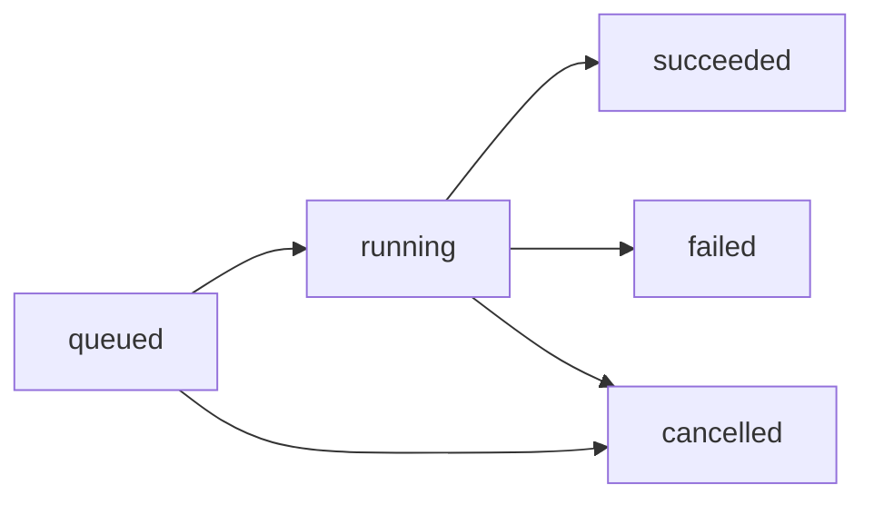

## Endpoint

```
GET /pipeline/run/:jobId
```

Returns the current status and metadata for a specific pipeline job.

## Path Parameters

<ParamField path="jobId" type="string" required>
  The UUID of the pipeline job to query
</ParamField>

## Response

<ResponseField name="id" type="string">
  UUID of the job
</ResponseField>

<ResponseField name="status" type="string">
  Current job status:
  - `"queued"` - Job is waiting to be processed
  - `"running"` - Job is currently being processed
  - `"succeeded"` - Job completed successfully
  - `"failed"` - Job failed with an error
  - `"cancelled"` - Job was cancelled (not currently implemented)
</ResponseField>

<ResponseField name="createdAt" type="string">
  ISO 8601 timestamp when the job was created
</ResponseField>

<ResponseField name="updatedAt" type="string">
  ISO 8601 timestamp when the job status was last updated
</ResponseField>

<ResponseField name="startedAt" type="string | null">
  ISO 8601 timestamp when the job started processing (null if not started yet)
</ResponseField>

<ResponseField name="finishedAt" type="string | null">
  ISO 8601 timestamp when the job finished (null if not finished yet)
</ResponseField>

## Examples

<CodeGroup>
```bash Request
curl http://localhost:3000/pipeline/run/a1b2c3d4-e5f6-7890-abcd-ef1234567890
```

```javascript Polling Loop
const pollJobStatus = async (jobId) => {
  const maxAttempts = 180; // 6 minutes (2s interval)
  
  for (let i = 0; i < maxAttempts; i++) {
    const response = await fetch(`http://localhost:3000/pipeline/run/${jobId}`);
    const job = await response.json();
    
    console.log(`Job ${job.status} (attempt ${i + 1})`);
    
    if (job.status === 'succeeded') {
      return { success: true, job };
    }
    
    if (job.status === 'failed') {
      return { success: false, job };
    }
    
    // Wait 2 seconds before next poll
    await new Promise(resolve => setTimeout(resolve, 2000));
  }
  
  throw new Error('Job timeout');
};
```
</CodeGroup>

<CodeGroup>
```json 200 Success (Queued)
{
  "id": "a1b2c3d4-e5f6-7890-abcd-ef1234567890",
  "status": "queued",
  "createdAt": "2024-03-16T10:30:00Z",
  "updatedAt": "2024-03-16T10:30:00Z",
  "startedAt": null,
  "finishedAt": null
}
```

```json 200 Success (Running)
{
  "id": "a1b2c3d4-e5f6-7890-abcd-ef1234567890",
  "status": "running",
  "createdAt": "2024-03-16T10:30:00Z",
  "updatedAt": "2024-03-16T10:30:15Z",
  "startedAt": "2024-03-16T10:30:15Z",
  "finishedAt": null
}
```

```json 200 Success (Succeeded)
{
  "id": "a1b2c3d4-e5f6-7890-abcd-ef1234567890",
  "status": "succeeded",
  "createdAt": "2024-03-16T10:30:00Z",
  "updatedAt": "2024-03-16T10:35:42Z",
  "startedAt": "2024-03-16T10:30:15Z",
  "finishedAt": "2024-03-16T10:35:42Z"
}
```

```json 200 Success (Failed)
{
  "id": "a1b2c3d4-e5f6-7890-abcd-ef1234567890",
  "status": "failed",
  "createdAt": "2024-03-16T10:30:00Z",
  "updatedAt": "2024-03-16T10:31:05Z",
  "startedAt": "2024-03-16T10:30:15Z",
  "finishedAt": "2024-03-16T10:31:05Z"
}
```

```json 404 Not Found
{
  "error": "Job not found"
}
```
</CodeGroup>

## Calculating Duration

You can compute job duration from the timestamps:

```javascript
const job = await response.json();

if (job.startedAt && job.finishedAt) {
  const duration = new Date(job.finishedAt) - new Date(job.startedAt);
  console.log(`Job took ${duration / 1000} seconds`);
}

if (job.startedAt && job.status === 'running') {
  const elapsed = Date.now() - new Date(job.startedAt);
  console.log(`Job has been running for ${elapsed / 1000} seconds`);
}
```

## Status Transitions

Valid status transitions:



<Note>
Cancellation is not currently implemented but the status is reserved for future use.
</Note>

## Polling Best Practices

### Recommended Polling Strategy

```javascript
const pollWithBackoff = async (jobId) => {
  let interval = 1000; // Start with 1 second
  const maxInterval = 10000; // Max 10 seconds
  const maxAttempts = 100;
  
  for (let i = 0; i < maxAttempts; i++) {
    const response = await fetch(`http://localhost:3000/pipeline/run/${jobId}`);
    const job = await response.json();
    
    if (job.status === 'succeeded' || job.status === 'failed') {
      return job;
    }
    
    await new Promise(resolve => setTimeout(resolve, interval));
    
    // Exponential backoff
    interval = Math.min(interval * 1.2, maxInterval);
  }
  
  throw new Error('Polling timeout');
};
```

### Avoid Over-Polling

<Warning>
**Do not poll more frequently than once per second.** The pipeline worker checks for new jobs every 2 seconds by default, so faster polling provides no benefit and wastes resources.
</Warning>

Recommended intervals:
- Initial poll: 1 second
- After 10 seconds: 2 seconds
- After 1 minute: 5 seconds
- After 5 minutes: 10 seconds

## Alternative: List User Jobs

You can also query all jobs for a user:

```bash
curl "http://localhost:3000/pipeline/run?username=johndoe"
```

Response:
```json
{
  "jobs": [
    {
      "id": "a1b2c3d4-e5f6-7890-abcd-ef1234567890",
      "status": "succeeded",
      "createdAt": "2024-03-16T10:30:00Z",
      "updatedAt": "2024-03-16T10:35:42Z",
      "startedAt": "2024-03-16T10:30:15Z",
      "finishedAt": "2024-03-16T10:35:42Z"
    },
    {
      "id": "b2c3d4e5-f6a7-8901-bcde-f12345678901",
      "status": "failed",
      "createdAt": "2024-03-15T14:20:00Z",
      "updatedAt": "2024-03-15T14:21:30Z",
      "startedAt": "2024-03-15T14:20:10Z",
      "finishedAt": "2024-03-15T14:21:30Z"
    }
  ]
}
```

## Use Cases

- **Progress indicators**: Show "Processing..." UI while job is running
- **Completion notifications**: Alert user when job finishes
- **Error handling**: Detect failures and prompt retry
- **Job history**: Display past pipeline runs
- **Debugging**: Investigate failed jobs with timestamps

## Notes

<Note>
- Job records persist indefinitely in the database
- Failed jobs can be investigated via server logs
- The `updatedAt` timestamp changes whenever status changes
- Jobs are processed in FIFO order (first-in, first-out)
</Note>

## Related Endpoints

- [POST /pipeline/run](/api/pipeline/run-pipeline) - Queue a new pipeline job
- [GET /pipeline/run?username=...](#alternative-list-user-jobs) - List all jobs for a user