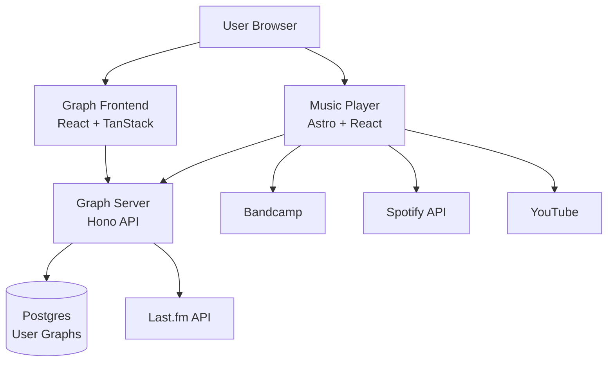

## System Overview

Rotations is built as a **monorepo** with three main components that work together to provide a complete music listening and analysis experience.



## Core Components

<CardGroup cols={3}>
  <Card title="Music Player" icon="music" href="/developers/music-player">
    Frontend music player with rotations
  </Card>
  <Card title="Graph Server" icon="server" href="/developers/graph-server">
    API for listening graph data
  </Card>
  <Card title="Graph Frontend" icon="chart-network" href="/developers/graph-frontend">
    Interactive graph visualization
  </Card>
</CardGroup>

## Music Player (site/)

**Technology Stack:**
- **Framework:** Astro 5.x with React islands
- **State Management:** TinyBase (reactive data store)
- **UI:** Radix UI components + Tailwind CSS
- **Music Sources:** Bandcamp, Spotify, YouTube APIs
- **Storage:** IndexedDB for offline caching

**Key Features:**
- Import-only music library
- Automatic rotation system
- Offline mode with automatic caching
- Multi-playlist support
- Cross-source playback

**Architecture Pattern:**

```typescript
// React Context provides playback state
PlayerContext → PlayerView → PlayerLayout
                          ↓
                    Audio Element
                          ↓
                    TinyBase Store
                          ↓
                    IndexedDB Cache
```

## Graph Server (graph-server/)

**Technology Stack:**
- **Framework:** Hono (lightweight Node.js web framework)
- **Database:** Postgres 16 with pg driver
- **Runtime:** Node.js 20+ with TypeScript
- **Data Pipeline:** Last.fm API client

**Key Features:**
- Directed weighted graph construction
- PageRank algorithm for song ranking
- Cluster detection (connected components)
- Multi-layout computation (radial, MDS)
- Async pipeline jobs with status tracking

**Data Flow:**

<Steps>
  <Step title="Ingest">
    Fetch scrobbles from Last.fm API
  </Step>
  <Step title="Normalize">
    Convert to canonical `SongKey` format: `artist::track`
  </Step>
  <Step title="Build Graph">
    Create nodes and weighted edges from sequential plays
  </Step>
  <Step title="Enrich">
    Compute PageRank, detect clusters, calculate statistics
  </Step>
  <Step title="Layout">
    Pre-compute node positions for each layout mode
  </Step>
  <Step title="Persist">
    Store per-user graph data in Postgres
  </Step>
</Steps>

## Graph Frontend (graph-frontend/)

**Technology Stack:**
- **Framework:** React 19 with TanStack Router
- **Rendering:** Sigma.js for WebGL graph rendering
- **Graphology:** Graph data structure library
- **UI:** Radix UI + Tailwind CSS
- **Build:** Vite with React plugin

**Key Features:**
- Interactive force-directed graph layout
- Node search and filtering
- Neighbor exploration with depth control
- Shortest/strongest path finding
- Cluster visualization

**Rendering Pipeline:**

```typescript
// Fetch graph data from API
API Response → CompactGraph
              ↓
// Convert to Graphology format
Graphology.DirectedGraph
              ↓
// Render with Sigma.js
SigmaContainer → WebGL Canvas
```

## Data Models

### SongKey (Canonical Identity)

```typescript
type SongKey = `${string}::${string}`;
// Example: "radiohead::paranoid android"
```

Enables cross-source matching by normalizing artist and track names.

### GraphNode

```typescript
interface GraphNode {
  name: string;
  artists: string[];
  albumName?: string;
  next: Record<SongKey, number>;      // Outgoing edges with weights
  previous: Record<SongKey, number>;  // Incoming edges with weights
  totalPlays: number;
  pageRank?: number;
  clusterId?: number;
  playDates: string[];
  positions?: LayoutPositions;        // Pre-computed x/y coords
}
```

### ListeningGraph

```typescript
interface ListeningGraph {
  nodes: Record<SongKey, GraphNode>;
  metadata: {
    totalScrobbles: number;
    dateRange: { from: string; to: string };
    exportTimestamp: string;
    lastfmUsername?: string;
  };
}
```

## Communication Patterns

### Music Player ↔ External APIs

- **Direct Integration:** Music player makes direct API calls to Bandcamp, Spotify, YouTube
- **Server Proxy:** Some endpoints proxied through Astro API routes (e.g., `/api/audio/proxy.ts`)
- **OAuth Flow:** Spotify requires OAuth 2.0 with PKCE flow

### Graph Frontend ↔ Graph Server

- **REST API:** All communication via HTTP JSON endpoints
- **User Scoped:** All requests include `?user=<username>` query parameter
- **Pagination:** Large graphs support `limit` and `offset` params

## Storage Architecture

### Client-Side (Music Player)

<CardGroup cols={2}>
  <Card title="TinyBase Store" icon="database">
    In-memory reactive state for playlists, tracks, playback
  </Card>
  <Card title="IndexedDB" icon="hard-drive">
    Persistent audio file cache for offline mode
  </Card>
</CardGroup>

### Server-Side (Graph Server)

```sql
-- User isolation
users (id, username, created_at)

-- Graph data
nodes (id, user_id, song_key, name, artists, ...)
edges (from_node, to_node, weight)
metadata (user_id, total_scrobbles, date_range, ...)

-- Pipeline jobs
pipeline_jobs (id, user_id, status, created_at, ...)
```

## Scalability Considerations

<Note>
  **Current Design:** Single-server deployment suitable for personal use and small teams.
</Note>

**Performance Characteristics:**
- PageRank converges in ~20 iterations for typical graphs
- Layout computation is O(n²) - cached in database
- Postgres handles 100k+ nodes efficiently
- Sigma.js renders 10k+ nodes at 60fps

## Next Steps

<CardGroup cols={2}>
  <Card title="Project Structure" icon="folder-tree" href="/developers/project-structure">
    Explore the codebase organization
  </Card>
  <Card title="Music Player Component" icon="music" href="/developers/music-player">
    Deep dive into the player implementation
  </Card>
  <Card title="Graph Server Component" icon="server" href="/developers/graph-server">
    Understand the API and pipeline
  </Card>
  <Card title="Local Development" icon="code" href="/developers/local-development">
    Start building features
  </Card>
</CardGroup>